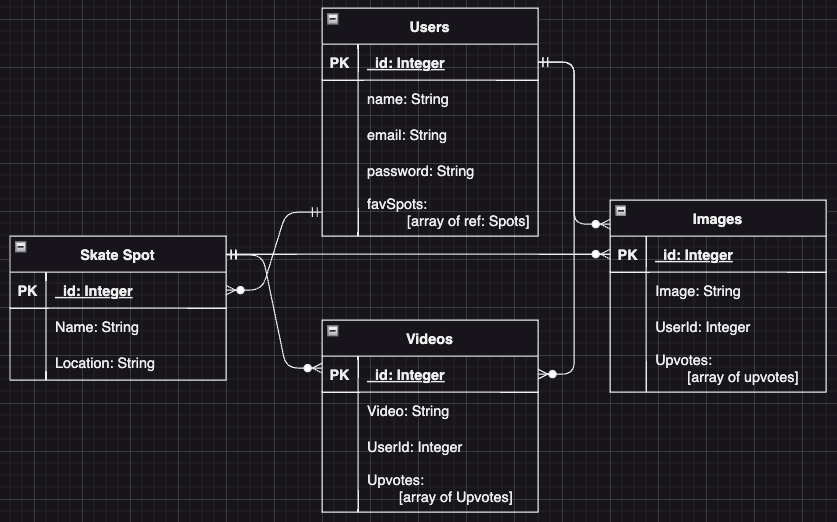

# Find ONE and Skate

# About the App

# ERDs

# Restful Routing Chart

# Wireframes of all user views

# User Stories

* As a user, I want to be able to create a new profile with an email and password
* As a user, I want to be able to sign in to my account
* As a user, I want to be able to update my password
* As a user, I want to be able to search on the map for the skate spots
* As a user, I want to be able to click on a pin to see the skate spot images and videos
* As a user, I want to be able to add favorite skate spots to be saved to my profile
* As a user, I want to be able to create a new skate spot and add images and videos of that skate spot
* As a user, I want to be able to delete a skate spot I have created or favorited
* As a user, I want to be able to add/delete additional images and videos of a skate spot I have created

* As a user, I want to be able to delete a favorite skate spot from my profile

# MVP goals

* Users can create account with email and password
* Users can sign into their accounts
* Users can create new habits, filling out a form
* Users can favorite habits

# Strech Goals 
* Geolocation API for users location
*